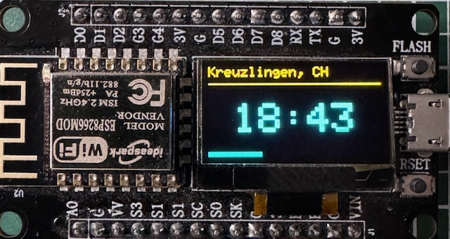
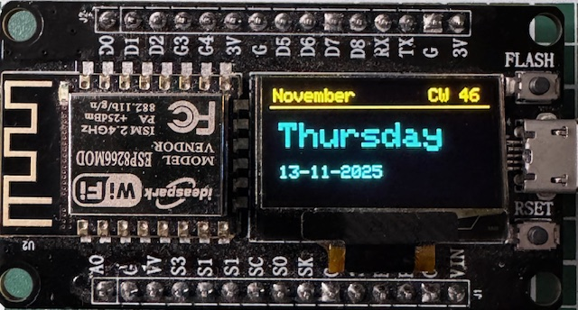
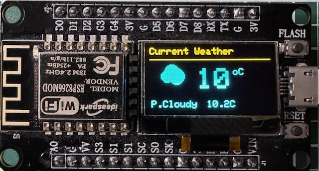
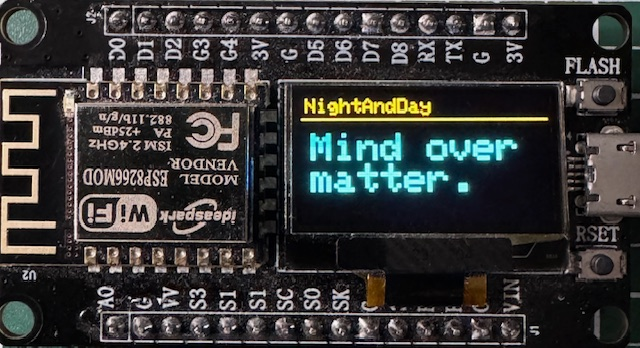
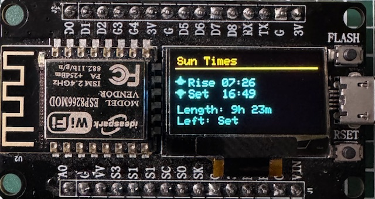
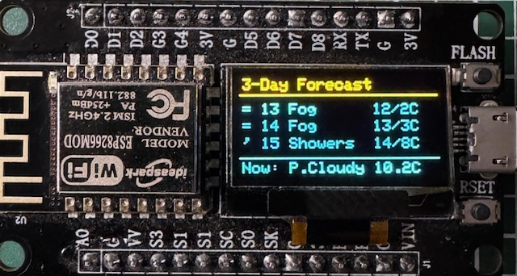
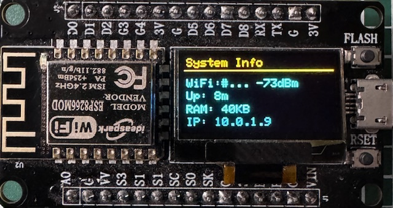

# MicroDashboard

ESP8266-based OLED weather dashboard with multiple information views and a beautiful web interface.

## Features

### OLED Display (8 Rotating Views)
- **Clock View**: Large time display with location and seconds progress bar
- **Date View**: Current date with calendar week
- **Current Weather**: Live weather with icon and temperature
- **3-Day Forecast**: Weather forecast with icons and temperature ranges
- **Sun Times**: Sunrise/sunset times and day length
- **Moon Phase**: Current moon phase with illumination percentage
- **Quote View**: Rotating motivational quotes with WiFi SSID
- **System Info**: WiFi signal, uptime, memory, and IP address

### Web Dashboard 🌐
- **Modern UI**: Beautiful gradient design with card-based layout
- **Live Updates**: Auto-refresh every 10 seconds
- **REST API**: JSON endpoint at `/api` for all sensor data
- **Settings Page**: Configure location, temperature unit, and view duration
- **Responsive**: Works on desktop, tablet, and mobile
- **Weather Emojis**: Visual weather and moon phase indicators

**Access the dashboard:** `http://<ESP_IP>/`

## Screenshots

<table>
  <tr>
    <td><br/><b>Clock View</b></td>
    <td><br/><b>Date View</b></td>
  </tr>
  <tr>
    <td><br/><b>Current Weather</b></td>
    <td><br/><b>Quote View</b></td>
  </tr>
  <tr>
    <td><br/><b>Sun Times</b></td>
    <td><br/><b>Moon Phase</b></td>
  </tr>
  <tr>
    <td><br/><b></b>3-Day Forecast</td>
    <td><br/><b>System Info</b></td>
  </tr>
</table>

## Hardware

- ESP8266 (ESP-12E/NodeMCU)
- SSD1306 OLED Display (128x64, I2C)
- I2C Pins: SDA=D6 (GPIO12), SCL=D7 (GPIO14)

## Weather Data

- Uses Open-Meteo API (free, no API key required)
- Automatic geocoding for city locations
- Automatic timezone detection
- Weather codes: WMO standard

## Configuration

### Initial Setup
On first boot, the device creates a WiFi access point "ESP-Config":
- City/Location
- Temperature unit (C/F/Both)
- View duration (seconds)
- Manual coordinates (optional)

### Web Interface
After connecting to WiFi, access the dashboard:
1. Check the serial monitor for the IP address
2. Open `http://<ESP_IP>/` in your browser
3. Click "⚙️ Settings" to modify configuration
4. Changes are saved to LittleFS and persist across reboots

### API Endpoint
Get JSON data: `http://<ESP_IP>/api`

Returns all sensor data including temperature, weather, sun/moon info, and system stats.

## Dependencies

- Adafruit GFX Library
- Adafruit SSD1306
- WiFiManager
- ArduinoJson
- LittleFS

## Building

This is a PlatformIO project. To build:

```bash
pio run
pio run --target upload
```

## License

MIT
